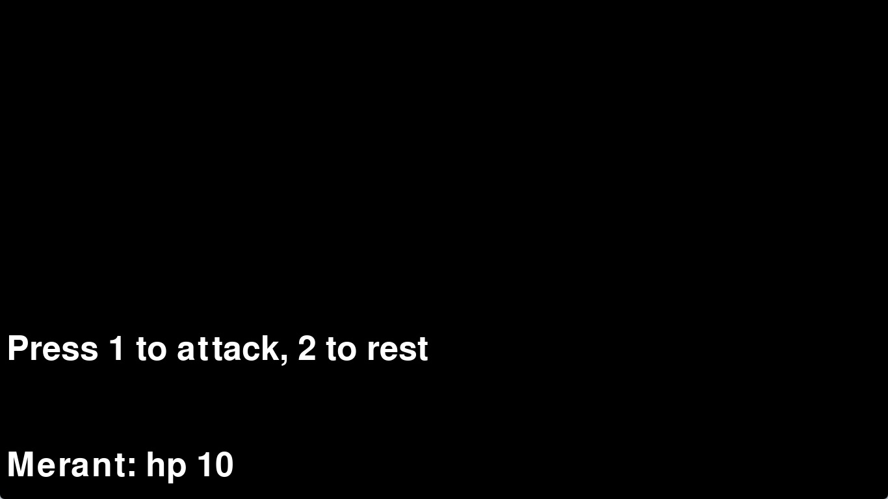

:warning: Everything between << >> needs to be replaced (remove << >> after replacing)

#  Easy-py 
## CS110 Final Project fall semester, 2023 

## Team Members

Chuma Ogwulumba, Joshua Medina

***

## Project Description

An rpg with stats attack options, and a modicum of plot

***    

## GUI Design

### Initial Design

### Final Design

## Program Design

### Features

1.  moveable character 
2.  boss battles  
3.  scrolling text
4.  in battle narration
5.  save data 

### Classes

- Unit: Template for the Hero and Enemy class. Holds the stats for the RPG unit and can attact another unit.
- Hero: Inherites from Unit can accumulate Exp for a level up and when hp reaches zero a boolean is returned for a game over.
- Enemy: Inherites from Unit and holds an Exp value and when hp reaches zero a boolean is returned for victory.
- BattleDis: Displays the information for the battle sequence
- BattleSeq: Processes the data for player action during a battle
- Controller: main hub for the game and selects pygame screens
- HealthBar: displays the health bar for the player (DEPRECATED)
- OverworldUnit: processes the data for the player in the overworld
- Narration: displays a line of text scrolling upwards from a file
- Overworld: displays the overworld and the player
- SaveDis: displays the save selection options for the player
- SaveSelec: processes the player's selection of save file
- SaveProg: Updates the save data based on player progression

## ATP

Test Case 1: Save management
Test Description: Test is player is able to save game into a save file
    Test steps:
    1. Press Start through the title screen.
    2. Press a number on the keyboard for a save.
    3. verify that the savefile is selectable and is altered when the file is written to.
    Expected Outcome: The player should be able to select a file and the file is changed when the player saves.

Test Case 2: Player movement
Test Description: Verify the player's character is able to move around the screen as expected
    Test steps:
    1. Get to the overworld in the game.
    2. press the left, up, down, right arrow keys.
    3. verify the the character the player controls moves in the respective direction.
    Expected Outcome: The player should be able to move the character in accordence to the arrow key inputs given.

Test Case 3: Scrolling text
Test Description: Verify the game's sotry line scrolls upward on the screen
    Test steps:
    1. Get past save selection and start the game.
    2. read the story scrolling upwards (like Star Wars).
    3. verify that all of the text is there and in the correct order.
    Expected Outcome: The player should be able to read and understand the story by plain observation after entering it.

Test Case 4: Conflict Resolution
Test Description: Confirm that player can attack enemies and enimies can attack player and game ends approiately to the outcome of battle.
    Test steps;
    1. Enter into and RPG battle.
    2. Select the attack option.
    3. verify that the enemy's health goes down.
    4. Get the enemy's health to 0.
    5. verify that the battle ends in player victory.
    6. the enemy attacks the player character.
    7. verify that the player's health goes down.
    8. the enemy gets the player's health to go to 0.
    9. verify the battle ends in a gameover.
    Expected Outcome: The battle should terminated when either combatants health goes to zero and go to the appropriate screen in accordance with the player's success.

Test Case 5: Health Display
Test Description: test that player is able to see character's health on the game screen.
    1. Start the game.
    2. See health displayed on screen.
    2. Play game until you get atacked.
    3. Verify that health updates after taking damage.
    Expected Outcome: Player's health should be displayed on screen and should update after taking damage.